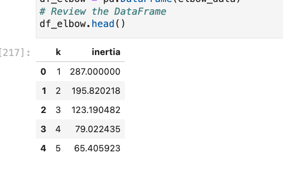

# Unsupervised_Learning_Module10_Homework

# Unsupervised_Learning_Module10_Homework

Import the Data (provided in the starter code)

 
 
Reviewing what the df looks lke 

 
 
Prepare the Data (provided in the starter code)

 
 
 

Find the Best Value for k Using the Original Data

The best value for k 

 
 
 

Cluster Cryptocurrencies with K-means Using the Original Data

 
 
 

Optimize Clusters with Principal Component Analysis

 
 

Adding column names and index to PCA

Find the Best Value for k Using the PCA Data

 
 
 

Cluster the Cryptocurrencies with K-means Using the PCA Data

 
 
 

Visualize and Compare the Results

 
 
 

## clustering with fewer features seams to produce more distinct clusters ##
